# AWS account setup — visual walkthrough

A step-by-step, screenshot-driven version of the AWS sign-up tutorial, for
people who'd rather read than watch. Same content as the
[video tutorial](../videos/tutorial_aws_setup.mp4) (10 min); pick whichever
fits you.

This guide takes you from "no AWS account" to "sharktopus can deploy the
cropper to your account" — covering sign-up, IAM user, access keys, MFA,
and a zero-spend budget alert.

For a shorter, cloud-agnostic overview, see
[ACCOUNT_SETUP.md](ACCOUNT_SETUP.md). For the technical deploy that runs
**after** this setup, see [DEPLOY_AWS.md](DEPLOY_AWS.md).

---

## What sharktopus does

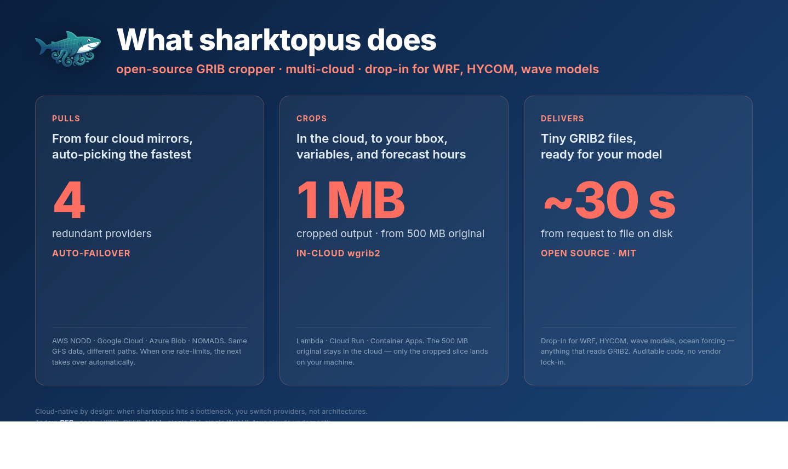

Sharktopus is an open-source GRIB cropper. GFS today, HRRR tomorrow — who
knows next. A single GFS forecast file is about 500 MB and you need dozens
of them per cycle. Sharktopus pulls from four cloud mirrors, automatically
picks whichever is fastest, and slices each file in the cloud down to just
the area, variables, and forecast hours your model actually needs. What
lands on your machine is around 1 MB per file, in about 30 seconds —
ready to feed WRF, HYCOM, wave models, or anything that reads GRIB.

The project began inside CONVECT — a research effort led by
**Dr. Tânia Oda** at **IEAPM** (the Brazilian Navy's Admiral Paulo Moreira
Institute for Sea Studies), funded by **CNPq** (Brazil's national
research-funding agency) — and is now an independent, MIT-licensed
community project on GitHub. Contributions welcome.

---

## Why bother with AWS Free Tier

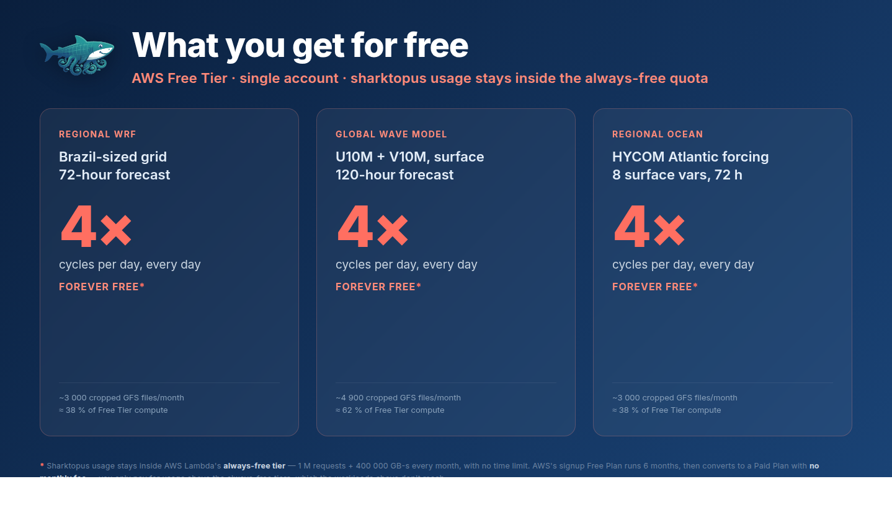

The numbers above are real: a regional WRF forecast for Brazil, an
operational global wave model, and a regional ocean model — all running
**four times a day, every day, on a single AWS account, all for free.**
That's why we set up the account.

> *Sharktopus usage stays inside AWS Lambda's always-free tier (1 M requests
> + 400 000 GB-s every month, no time limit). The signup Free Plan runs 6
> months and then converts to a Paid Plan with no monthly fee — you only
> pay for usage above the always-free tier, which the workloads above don't
> reach.*

---

## Step 1 — Create the account

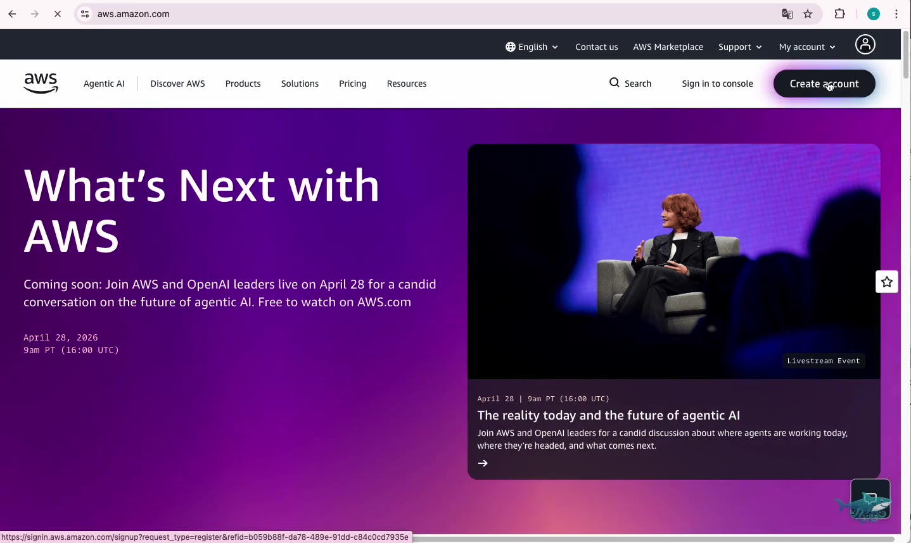

Go to <https://portal.aws.amazon.com/billing/signup> and click
**Create an AWS Account**.

---

## Step 2 — Email and account name

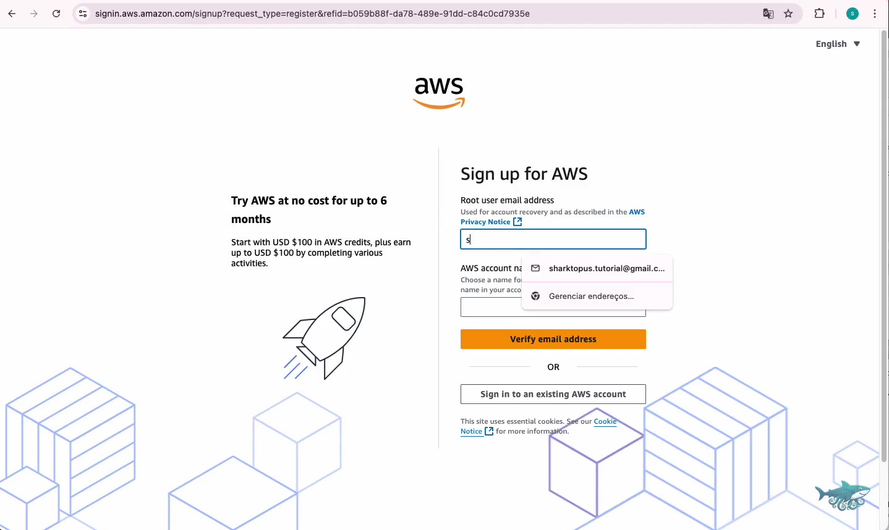

Enter the email you want as your AWS root login. This becomes your master
credential, so pick one you control long-term — ideally a shared inbox,
not a personal address that might change. Choose an account name; it's
just a label and can be renamed later. AWS will send a verification code
to this email.

---

## Step 3 — Verify the email

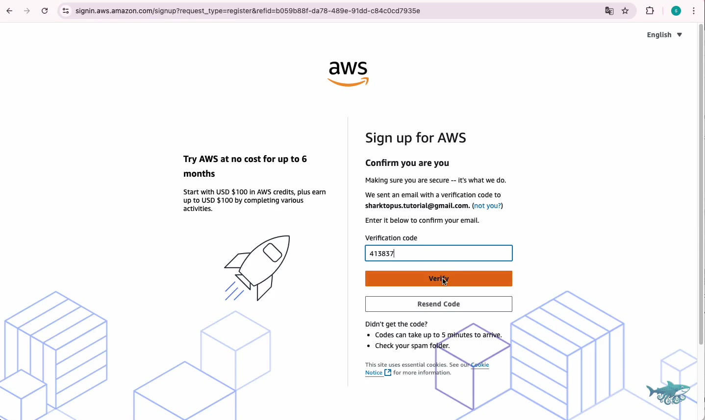

Check your inbox for the six-digit verification code. Paste it into the
field and confirm to continue.

---

## Step 4 — Root password

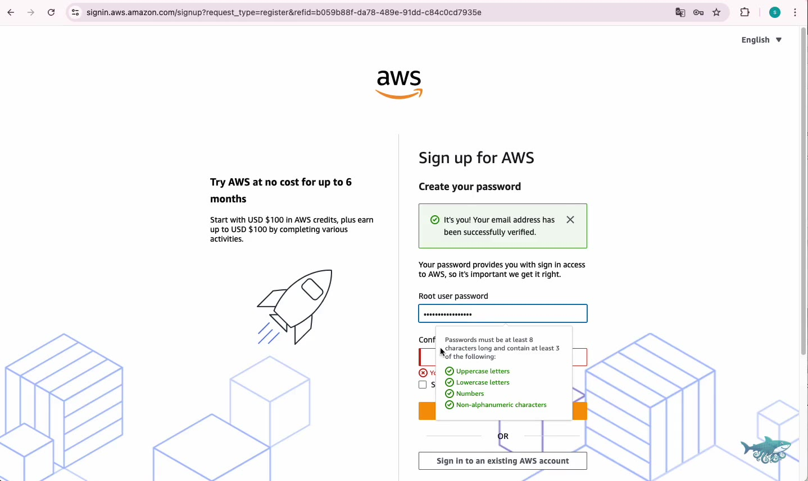

Set a strong root password and save it in a password manager. The root
account is for emergencies — we'll rarely use it.

---

## Step 5 — Choose the Free Plan

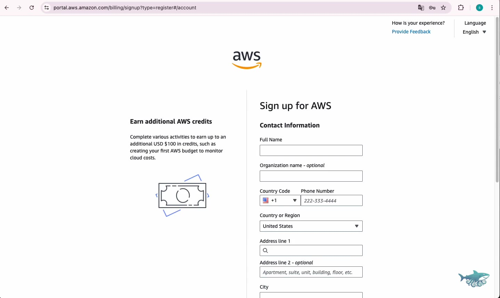

Pick the **Free Plan**. It gives you six months of free-tier services
across most AWS products, with no upfront cost or commitment.

---

## Step 6 — Contact info (basics)

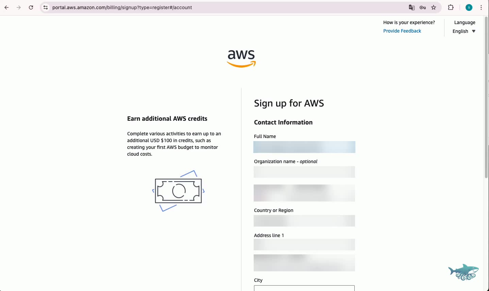

AWS now asks for contact information, used for billing and account
recovery. Pick **Personal** if this account is just for you, or
**Business** if it belongs to a company. Either choice is fine — the
practical difference is whether AWS asks for a tax ID later. Fill in your
full legal name, a phone number you can answer, and your country.

---

## Step 7 — Contact info (address)

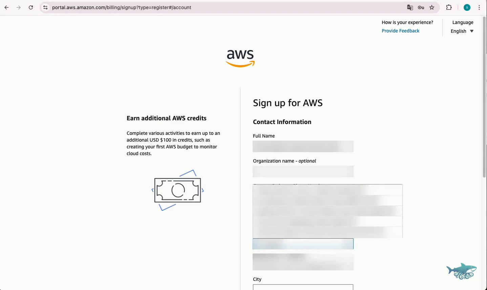

Continue with the address fields. Use a real, complete postal address.
AWS validates it against shipping providers and will reject obviously
fake addresses or PO boxes in some regions. Make sure the city, state,
and postal code are all consistent with each other; one bad field can
fail the whole submission.

Read the AWS Customer Agreement, then check the box to accept it. When
you click **Continue**, AWS submits everything. If a field is rejected,
AWS highlights it and your other fields stay filled.

---

## Step 8 — Billing and payment

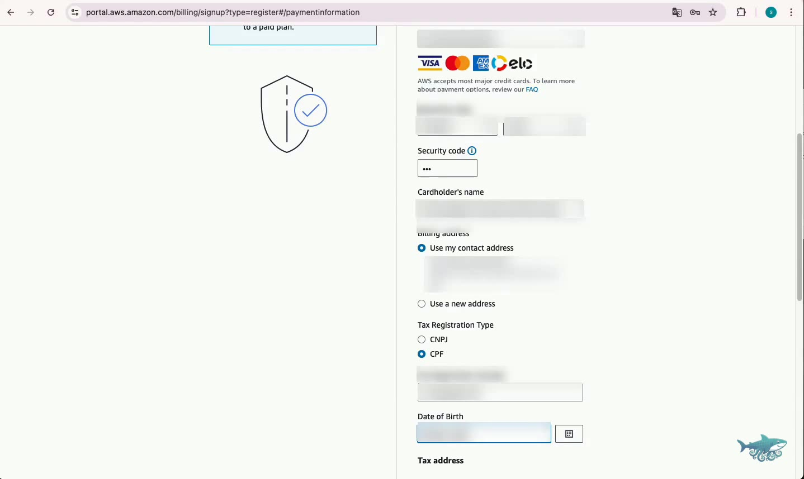

AWS now asks for a payment method. Even on the Free Plan, a credit card
or supported debit card is required to activate the account.

> **Practical safety tip:** use a prepaid or temporary card with a small
> balance for this initial setup. The Free Plan is generous, but a
> prepaid card caps your worst-case exposure to whatever balance is
> loaded on it. Once you've seen what sharktopus actually costs, you can
> switch to a regular card with an app-side spending limit. Heads-up:
> some prepaid cards reject international authorisation holds, so you
> might need to try a different one.

AWS charges a one-dollar verification fee that's refunded immediately.

Enter your card number, expiration date, and three-digit security code.
The cardholder name and billing address auto-fill from the previous step.

If you're outside the United States, AWS will probably ask for a tax
registration number. In Brazil, this is your CPF or CNPJ; in Europe, your
VAT number. The format check is strict — a missing digit or wrong country
code rejects the whole form.

Then AWS asks how you plan to use AWS (informational only) and offers a
paid support plan — pick **Basic Support** (free; you can upgrade later).

Finally AWS confirms the account is active and emails the account ID.

---

## Step 9 — Dismiss the welcome tour

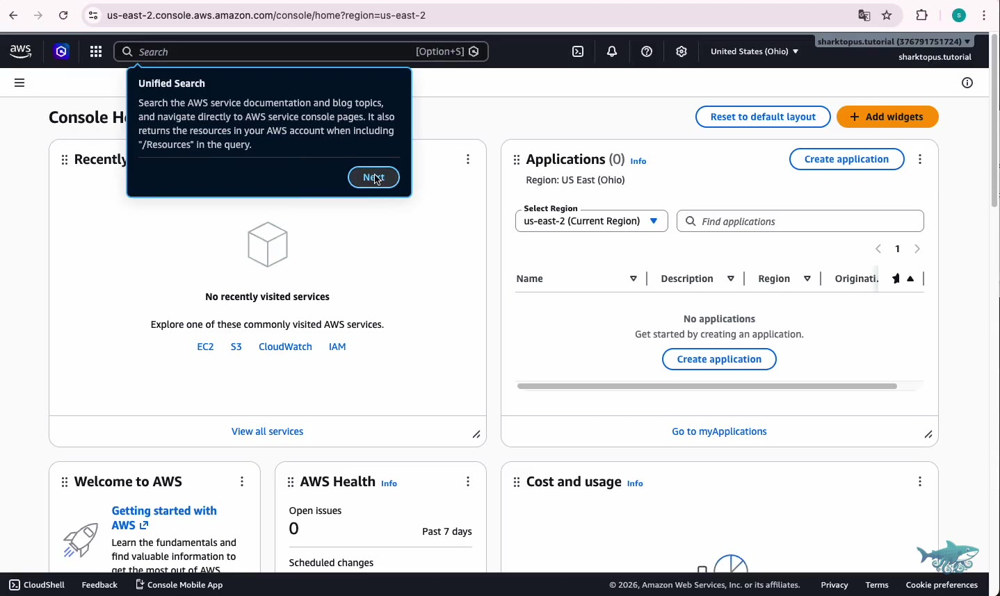

AWS opens a welcome tour. Dismiss it — we'll set everything up ourselves
from here.

---

## Step 10 — Open IAM

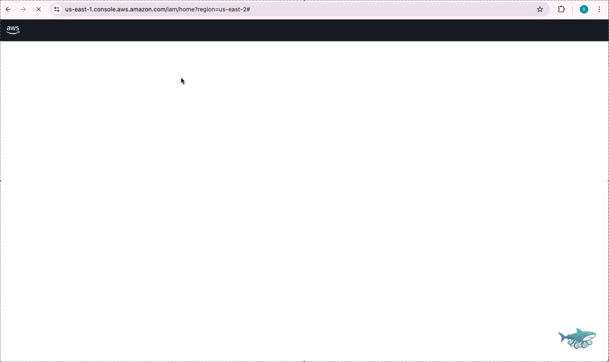

Now we'll create an IAM user. AWS strongly recommends never using the
root account for daily work — it has unrestricted permissions and can't
be locked down with policies. Type **IAM** in the search bar at the top
of the console and open the IAM service.

---

## Step 11a — Open Users → Create user

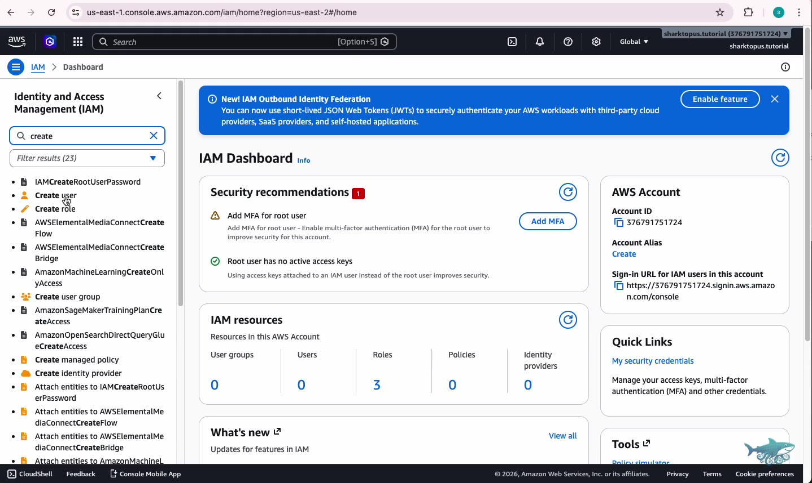

In the IAM dashboard, open the **Users** page from the left sidebar,
then click **Create user**. This launches a multi-step wizard for naming
the user, granting permissions, and choosing how they sign in. Every
step is reversible up to the final confirmation.

---

## Step 11b — Name the user and set its password

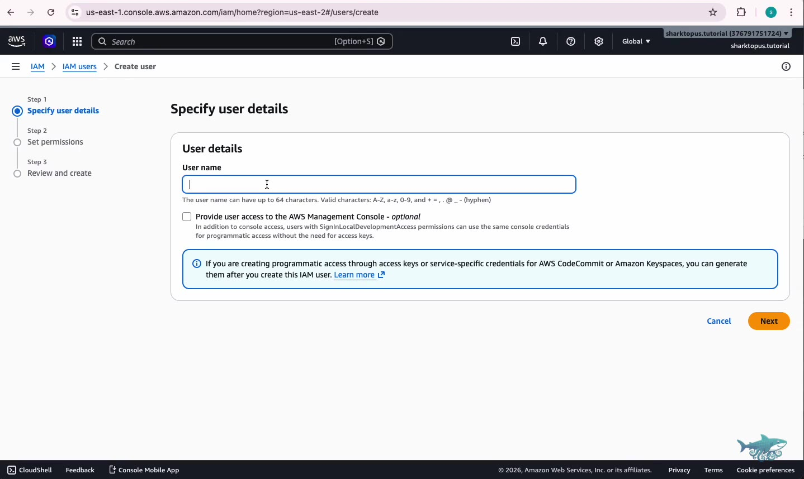

Give the user a memorable name. For sharktopus, something like
`sharktopus-deploy` is a good convention — it tells future-you what the
user is for.

Check **Provide user access to the AWS Management Console** if you also
want to sign in as this user manually. AWS offers two password options:

- **Autogenerated password** — AWS generates one for you; you'll have to
  reset it on first sign-in.
- **Custom password** — you type your own, manager-stored password that
  doesn't need an immediate reset.

Either is fine. Click **Next**.

---

## Step 11c — Attach AdministratorAccess

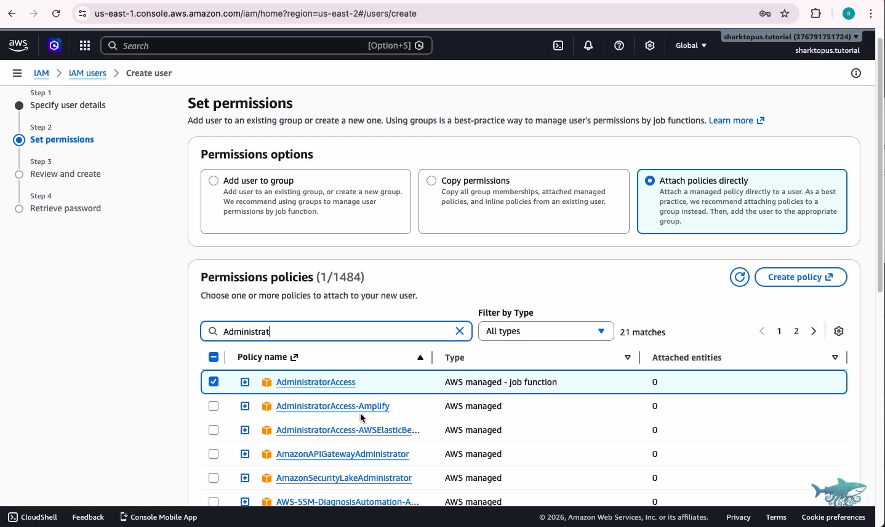

On the permissions page, choose **Attach policies directly**. Search for
**AdministratorAccess** and select it. This grants full access to every
AWS service, which sharktopus needs only during the initial deploy to
provision Lambda, Cloud Run, and Container Apps resources.

> Sharktopus is open source — the credentials you generate here stay on
> your machine and only ever talk to AWS itself. Once your first deploy
> works, you can come back to this same IAM page and revoke admin
> access (see [step 14](#step-14--zero-spend-budget--final-tips)).

Click **Next**, review the summary, then click **Create user**. AWS
provisions the user immediately and shows the console URL plus a
temporary password — **shown one time only**. Copy both into your
password manager now; they cannot be recovered later.

---

## Step 12 — Create access keys

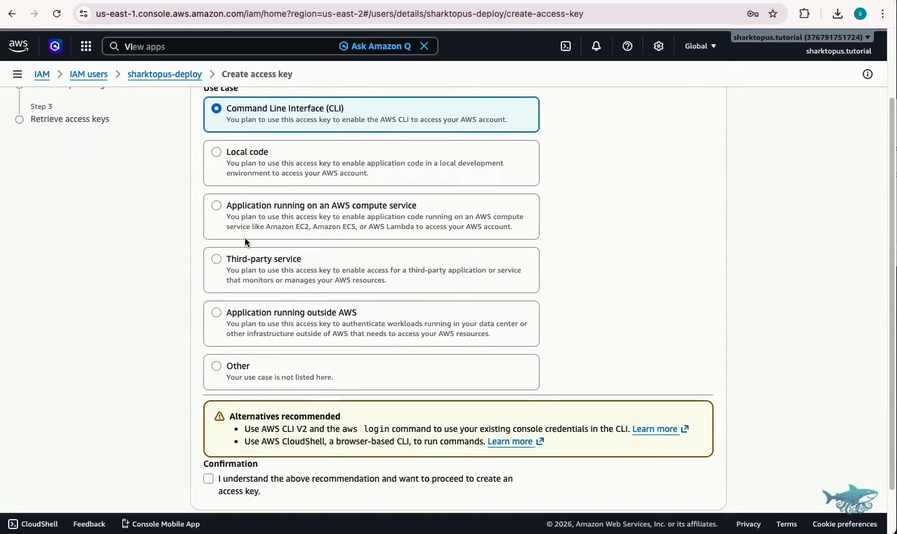

Now we generate programmatic access keys, so sharktopus can authenticate
to AWS APIs from your terminal.

1. Click the user's name in the **Users** list.
2. Open the **Security credentials** tab, scroll to **Access keys**.
3. Click **Create access key**.
4. Pick **Command Line Interface** as the use case.
5. AWS recommends IAM Identity Center over long-lived keys — that's the
   right call for an organisation with several developers and a security
   team, but for a solo tutorial like this, an access key is fine.
   Acknowledge the warning by checking the box and continue.
6. Add an optional description tag (e.g. `sharktopus-cli`). Click
   **Create access key**.

AWS shows the **Access key ID** and the **Secret access key**. The
secret is shown **only once** — there is no way to retrieve it after
this page. Copy both values immediately into your AWS credentials file
or a password manager.

---

## Step 13 — Enable MFA on root

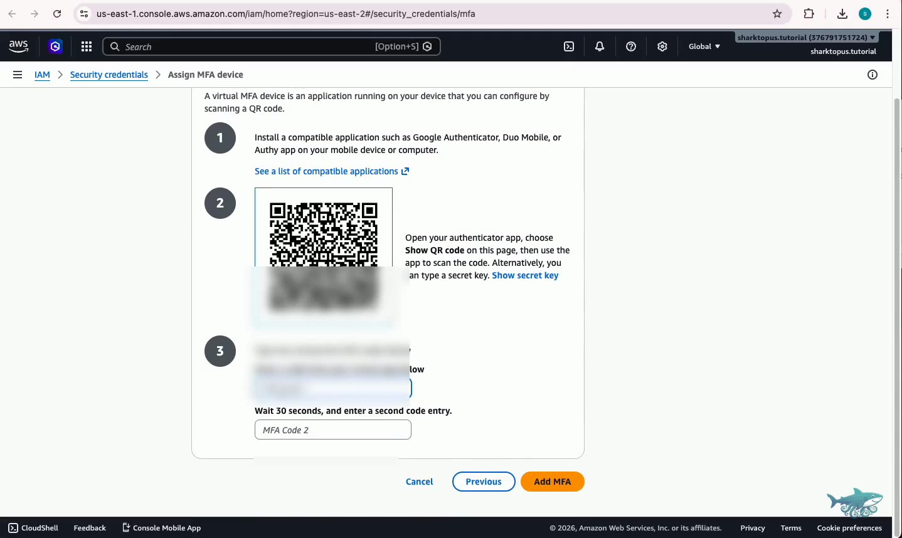

We won't use the root account day-to-day, but it's the most powerful
credential — so it must be protected. AWS strongly recommends MFA, and
many compliance frameworks require it.

1. Sign out of the IAM user and sign back in as **root**.
2. Open the account menu in the top-right and choose
   **Security credentials**.
3. Find the **MFA** section and click **Assign MFA device**.
4. Pick **Authenticator app**.
5. Scan the QR code with Authy, Google Authenticator, or any
   TOTP-compatible app.
6. Enter two consecutive six-digit codes to prove the device is synced,
   then submit.

From now on, root sign-in requires both the password and a fresh MFA
code.

---

## Step 14 — Zero-spend budget & final tips

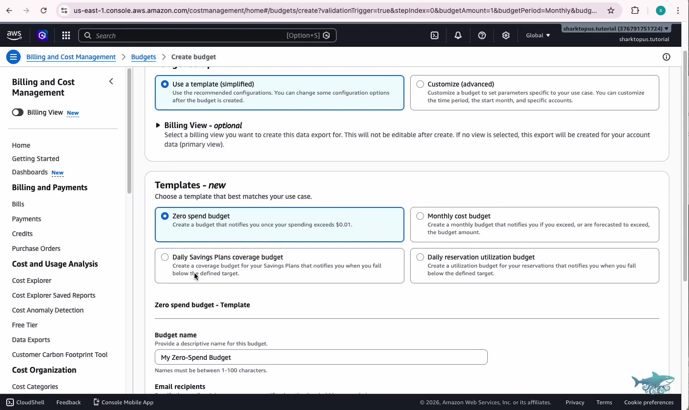

A free safety net that emails you the moment any AWS service charges
your account, even a few cents.

1. Open **Billing and Cost Management** → **Budgets** → **Create budget**.
2. Choose the **Zero spend budget** template — AWS pre-fills everything.
3. Add an email you actually check, and save.

With the prepaid card from [step 8](#step-8--billing-and-payment), you
now have two complementary layers: the budget tells you, the card stops
you.

> **One final tip:** once your first sharktopus deploy works, come back
> to IAM and remove `AdministratorAccess` from the
> `sharktopus-deploy` user. With the prepaid card and budget already in
> place, this is mostly about reducing damage if your keys are ever
> stolen — a one-minute job, optional but worth it.

---

## Next steps

You're done with the AWS sign-up. Now run:

```bash
sharktopus --setup aws
```

…to deploy the cropper. See [DEPLOY_AWS.md](DEPLOY_AWS.md) for what
happens during the deploy and how to verify it.
